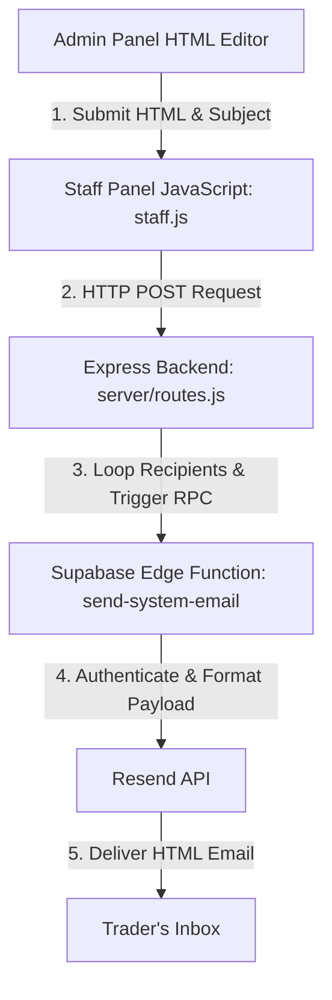

# Gain EX — Admin Email Events Setup Guide

This package contains the complete files and code snippets implemented to enable the **Admin Custom HTML Email Broadcast & Targeted Delivery** feature.

---

## 🚀 Architectural Flow



---

## 📦 Directory Structure of this Package

*   **`README.md`**: This guide.
*   **`edge_function/index.ts`**: The Deno Edge Function code deployed to Supabase that accepts `custom_email` payloads and routes them to the Resend API.
*   **`server/routes_snippet.js`**: The Express routing backend endpoints for specific list delivery and global broadcasting.
*   **`staff/index_snippet.html`**: The UI markup added to the admin tools panel.
*   **`staff/staff_snippet.js`**: Client-side logic managing editor keypresses, live sandboxed preview framing, and API dispatching.
*   **`staff/staff_snippet.css`**: Layout positioning code for the side-by-side composer grid and user selectors.

---

## 🛠️ Configuration & Credentials

### 1. Resend API Key setup in Supabase
The Edge Function fetches the `RESEND_API_KEY` secret directly from your Supabase vault configuration. Set it via the Supabase CLI or Dashboard:
```bash
supabase secrets set RESEND_API_KEY="your-resend-api-key"
```

### 2. Edge Function Deployment
Deploy the `send-system-email` function using the Supabase CLI:
```bash
supabase functions deploy send-system-email
```

---

## 📂 Code & Logic Explanations

### 1. Supabase Edge Function (`edge_function/index.ts`)
*   Provides a central HTTP microservice for sending transactional security emails.
*   Authenticates queries via Supabase project secret keys.
*   Supports standard event types (`kyc_verified`, `deposit_approved`, etc.) and the newly added `custom_email` event type.
*   In the `custom_email` case, it forwards the sender's custom subject line and raw HTML payload directly to the Resend client.

### 2. Express Server (`server/routes_snippet.js`)
*   **`POST /admin/email/send`**:
    *   Verifies authorization (Admin only).
    *   Accepts `subject`, `html_content`, and `user_ids`.
    *   Queries user emails and loops through them to invoke the `sendSystemEmail` helper.
    *   Uses a 100ms throttle between iterations to avoid rate limit spikes.
*   **`POST /admin/email/send-all`**:
    *   Similar to above, but automatically queries all active registered users with verified emails to broadcast the HTML payload.

### 3. Staff UI HTML (`staff/index_snippet.html`)
*   Integrates a new "Email Events" selection section.
*   Creates a side-by-side panel structure: a raw code textarea editor on the left and a live-refreshing sandboxed `<iframe>` on the right.
*   Embeds a searchable modal popup containing checklists for admin users to quickly pick individual target recipients.

### 4. Client-side Controller (`staff/staff_snippet.js`)
*   Manages input listeners.
*   Implements a debounced preview (300ms) that sets the `srcdoc` property of the iframe to ensure smooth rendering without lag.
*   Collects selection checkboxes via a reactive JS `Set` and manages visual check indicators.
